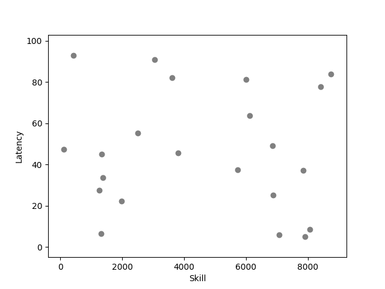

# MatchmakingEngine

[English :us:](#english) | [Русский :ru:](#русский)

---

###  <div id="english"> MatchmakingEngine </div>

This is a simple matchmaking microservice built with Go. The service forms groups of players for matchmaking based on several criteria, such as latency, skill level, and time spent in the queue. The service uses the Gin framework for handling HTTP requests, Viper for configuration management, and Redis for managing the matchmaking queue. Player grouping is implemented using the DBSCAN algorithm.

### Configuration

The service is configured through environment variables set in the `app.env` file. Below are the available configurations:

#### Environment Variables

- `SERVICE_PORT`: The port on which the matchmaking service runs. Default is `:8080`.
- `REDIS_ADDR`: The address of the Redis instance used for managing the player queue. Example: `172.20.0.2:6379`.
- `REDIS_PW`: The password for Redis. Leave empty if no password is required.
- `REDIS_DB`: The Redis database number to use. Default is `0`.
- `GROUP_SIZE`: The number of players required to form a group.
- `MAX_SKILL_DIFF`: The maximum allowable difference in skill between players in a group.
- `MAX_LATENCY_DIFF`: The maximum allowable difference in latency between players in a group.

### API Endpoints

#### Add Player to Matchmaking Queue

- **Endpoint**: `POST /users`
- **Description**: Adds a player to the matchmaking queue.
- **Parameters**:
    - `name`: (String) The name of the player.
    - `skill`: (Double) The skill level of the player.
    - `latency`: (Double) The latency of the player.

### Matchmaking Process

1. Players submit their details to the service via the `/users` endpoint.
2. The service stores the player information in a Redis queue.
3. The matchmaking process retrieves players from the queue and attempts to form a group based on the following criteria:
    - Minimize the difference in skill between players.
    - Minimize the difference in latency between players.
    - Minimize the time players spend waiting in the queue.
4. The DBSCAN algorithm is used to cluster players based on the Euclidean distance metric.
5. If a group is successfully formed, the following information is printed to `stdout`:
    - Sequential group number.
    - Min/Max/Avg skill in the group.
    - Min/Max/Avg latency in the group.
    - Min/Max/Avg time spent in the queue.
    - List of player names in the group.
6. If a group cannot be formed, the players are returned to the front of the queue.



### Running the Service

#### Steps

1. Set up the configuration in `app.env`.
2. Build and start the service using Docker Compose:

   ```bash
   docker-compose up --build
   ```

3. The service will be available at the port specified by `SERVICE_PORT` (default `:8080`).

### Testing the Service

A test client is included to simulate adding players to the matchmaking queue. The test client continuously sends random player data to the service.

#### Running the Test Client

1. Navigate to the `test_cli` directory.
2. Run the test client:

   ```bash
   go run main.go
   ```

This will simulate a series of players joining the matchmaking queue and help verify the service's functionality.

### Conclusion

This matchmaking microservice is designed to be simple yet effective in forming player groups for online games. By customizing the configuration parameters, the service can be tailored to different matchmaking requirements. The use of Redis ensures that the queue management is efficient and scalable, while the DBSCAN algorithm provides a flexible and powerful way to cluster players based on multiple criteria.

---

###  <div id="русский"> MatchmakingEngine </div>

Это простой микросервис для подбора игроков, написанный на Go. Сервис формирует группы игроков для подбора на основе нескольких критериев, таких как задержка, уровень навыков и время, проведенное в очереди. Сервис использует фреймворк Gin для обработки HTTP-запросов, Viper для управления конфигурацией и Redis для управления очередью подбора игроков. Группировка игроков реализована с использованием алгоритма DBSCAN.

### Конфигурация

Сервис настраивается через переменные окружения, заданные в файле `app.env`. Ниже приведены доступные настройки:

#### Переменные окружения

- `SERVICE_PORT`: Порт, на котором запускается сервис подбора игроков. По умолчанию `:8080`.
- `REDIS_ADDR`: Адрес экземпляра Redis, используемого для управления очередью игроков. Пример: `172.20.0.2:6379`.
- `REDIS_PW`: Пароль для Redis. Оставьте пустым, если пароль не требуется.
- `REDIS_DB`: Номер базы данных Redis, используемой по умолчанию. Значение по умолчанию — `0`.
- `GROUP_SIZE`: Количество игроков, необходимое для формирования группы.
- `MAX_SKILL_DIFF`: Максимально допустимая разница в навыках между игроками в группе.
- `MAX_LATENCY_DIFF`: Максимально допустимая разница в задержке между игроками в группе.

### API Эндпоинты

#### Добавление игрока в очередь подбора

- **Эндпоинт**: `POST /users`
- **Описание**: Добавляет игрока в очередь подбора.
- **Параметры**:
    - `name`: (String) Имя игрока.
    - `skill`: (Double) Уровень навыков игрока.
    - `latency`: (Double) Задержка у игрока.

### Процесс подбора игроков

1. Игроки отправляют свои данные на сервис через эндпоинт `/users`.
2. Сервис сохраняет информацию об игроках в очередь Redis.
3. Процесс подбора извлекает игроков из очереди и пытается сформировать группу на основе следующих критериев:
    - Минимизация разницы в навыках между игроками.
    - Минимизация разницы в задержке между игроками.
    - Минимизация времени ожидания в очереди.
4. Алгоритм DBSCAN используется для кластеризации игроков на основе евклидовой метрики.
5. Если группа успешно сформирована, следующая информация выводится в `stdout`:
    - Последовательный номер группы.
    - Минимум/Максимум/Средний уровень навыков в группе.
    - Минимум/Максимум/Средняя задержка в группе.
    - Минимум/Максимум/Среднее время ожидания в очереди.
    - Список имен игроков в группе.
6. Если группа не может быть сформирована, игроки возвращаются в начало очереди.


### Запуск сервиса

#### Шаги

1. Настройте конфигурацию в `app.env`.
2. Соберите и запустите сервис с помощью Docker Compose:

   ```bash
   docker-compose up --build
   ```

3. Сервис будет доступен на порту, указанном в `SERVICE_PORT` (по умолчанию `:8080`).

### Тестирование сервиса

В комплекте есть тестовый клиент для симуляции добавления игроков в очередь подбора. Тестовый клиент непрерывно отправляет случайные данные об игроках на сервис.

#### Запуск тестового клиента

1. Перейдите в директорию `test_cli`.
2. Запустите тестовый клиент:

   ```bash
   go run main.go
   ```

Это смоделирует процесс добавления игроков в очередь подбора и поможет проверить функциональность сервиса.

### Заключение

Этот микросервис для подбора игроков разработан как простой, но эффективный инструмент для формирования групп игроков в онлайн-играх. Путем настройки параметров конфигурации сервис можно адаптировать под различные требования подбора. Использование
Redis обеспечивает эффективное и масштабируемое управление очередью, а алгоритм DBSCAN предоставляет гибкий и мощный способ кластеризации игроков на основе множества критериев.
